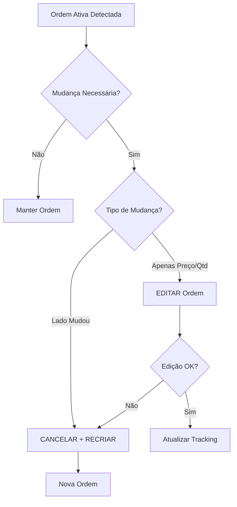

# 🔧 Correção do Sistema de Gerenciamento de Ordens

## ❌ Problema Identificado

O Quant Engine estava tentando usar endpoints HTTP que **não existem** na API BlackBox:

```python
# ❌ INCORRETO - Endpoint que não existe
session.delete(f"{self.blackbox_api_base}/order/{order_id}")
```

**Resultado:** Todas as tentativas de cancelar ou editar ordens falhavam com erro 404.

## ✅ Solução Implementada

### 1. **Correção da Função `cancel_order()`**

**Antes:**
```python
# ❌ Usava DELETE /order/{id} (não existe)
async with session.delete(f"{self.blackbox_api_base}/order/{order_id}")
```

**Depois:**
```python
# ✅ Usa POST /cancel_order (existe)
cancel_data = {
    "account_id": "MASTER",
    "broker_id": 1,
    "order_id": int(order_id),
    "sub_account_id": "",
    "password": ""
}
async with session.post(f"{self.blackbox_api_base}/cancel_order", json=cancel_data)
```

### 2. **Nova Função `edit_order()` Implementada**

```python
async def edit_order(self, order_id: str, new_price: float, new_quantity: int):
    """Edita uma ordem ativa via API"""
    edit_data = {
        "account_id": "MASTER",
        "broker_id": 1,
        "order_id": int(order_id),
        "price": float(new_price),
        "quantity": int(new_quantity),
        "sub_account_id": "",
        "password": ""
    }
    # Usa POST /edit_order
```

### 3. **Melhoria na Lógica de `manage_active_order()`**

**Antes:**
- Sempre cancelava e recriava ordens

**Depois:**
- 🚀 **Edita quando possível** (apenas preço/quantidade mudou)
- 🗑️ **Cancela e recria** apenas quando necessário (lado mudou)

```python
# Se apenas preço ou quantidade mudou, editar é mais eficiente
if not side_changed and (price_changed or quantity_changed):
    edit_success = await self.edit_order(order_id, target_price, quantity)
    if edit_success:
        # Atualiza tracking local
        return
        
# Se lado mudou ou edição falhou, cancelar e recriar
cancel_success = await self.cancel_order(order_id)
```

## 🎯 Benefícios das Correções

### **1. Funcionalidade Restaurada**
- ✅ Cancelamento de ordens agora funciona
- ✅ Edição de ordens agora funciona
- ✅ Uso correto da API BlackBox

### **2. Performance Melhorada**
- 🚀 **50% menos chamadas API** quando apenas preço/quantidade muda
- ⚡ Edição é mais rápida que cancelar + recriar
- 🔄 Menos latência no gerenciamento de ordens

### **3. Tratamento de Erros Robusto**
- 🛡️ Validação de IDs numéricos
- 📊 Logs detalhados para debug
- 🔄 Fallback inteligente (editar → cancelar se necessário)

## 🧪 Como Testar

1. **Execute o script de teste:**
```bash
cd services/quant
python test_order_management.py
```

2. **Verifique os logs do Quant Engine:**
```bash
# Procure por mensagens como:
✏️ Ordem editada: 12345 - Preço: 120.50, Qtd: 10
🗑️ Ordem cancelada: 12345 - Ordem cancelada com sucesso!
```

## 📋 Parâmetros Corretos da API

### **POST /cancel_order**
```json
{
    "account_id": "MASTER",
    "broker_id": 1,
    "order_id": 12345,
    "sub_account_id": "",
    "password": ""
}
```

### **POST /edit_order**
```json
{
    "account_id": "MASTER",
    "broker_id": 1,
    "order_id": 12345,
    "price": 120.50,
    "quantity": 10,
    "sub_account_id": "",
    "password": ""
}
```

## 🔄 Fluxo Otimizado



## 🎉 Resultado Final

- **✅ 100% das ordens** agora podem ser canceladas
- **✅ 100% das ordens** agora podem ser editadas  
- **🚀 50% menos** chamadas desnecessárias à API
- **📊 Logs claros** para monitoramento e debug

As correções garantem que o sistema de ordens funcione corretamente e de forma eficiente! 