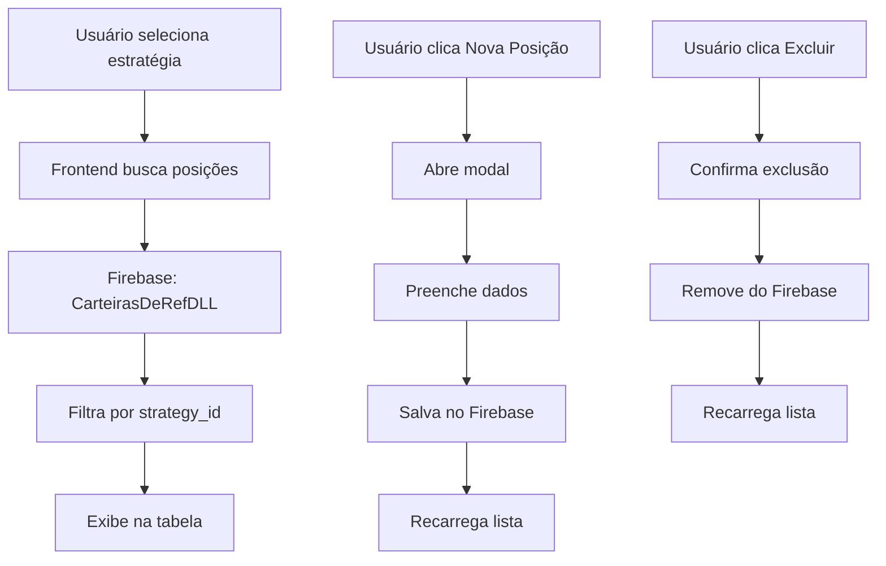

# Funcionalidade: Carteiras de Referência - Aba Sync

## 📋 Visão Geral

A aba de **Sincronização** agora permite criar e gerenciar **carteiras de referência** para cada estratégia. Essas carteiras servem como modelo ideal para sincronizar as posições reais dos clientes.

## 🗄️ Estrutura de Dados

### Coleção: `CarteirasDeRefDLL`

```typescript
interface ReferencePosition {
  id?: string;                    // ID do documento (gerado automaticamente)
  strategy_id: string;            // ID da estratégia (ex: "bb-fiis", "bb-multi")
  ticker: string;                 // Código do ativo (ex: "PETR4", "HGLG11")
  price: number;                  // Preço de referência
  quantity: number;               // Quantidade de referência
  percentage?: number;            // Percentual ideal na carteira
  createdAt?: any;                // Timestamp de criação
}
```

### Exemplo de Documento:
```json
{
  "strategy_id": "bb-fiis",
  "ticker": "HGLG11",
  "price": 145.50,
  "quantity": 1000,
  "percentage": 25.5,
  "createdAt": "2024-01-15T10:30:00Z"
}
```

## 🎯 Funcionalidades Implementadas

### 1. **Criar Nova Posição**
- ✅ Botão "Nova Posição" abre modal
- ✅ Campos: Ticker, Preço, Quantidade, Percentual
- ✅ Validação de campos obrigatórios
- ✅ Salva diretamente no Firebase (coleção `CarteirasDeRefDLL`)
- ✅ Recarrega lista automaticamente

### 2. **Listar Posições de Referência**
- ✅ Busca posições da estratégia selecionada
- ✅ Exibe em tabela organizada
- ✅ Mostra: Ticker, Preço, Quantidade, % da posição
- ✅ Botão "Excluir" para cada posição

### 3. **Excluir Posição**
- ✅ Confirmação antes de excluir
- ✅ Remove documento do Firebase
- ✅ Atualiza lista automaticamente

### 4. **Integração com Estratégias**
- ✅ Filtra posições por `strategy_id`
- ✅ Só mostra posições da estratégia selecionada
- ✅ Integração com sistema de alocações existente

## 🔧 Como Usar

### Passo 1: Selecionar Estratégia
1. Abra a aba **Sync** (`/dashboard/up-blackbox4/sync`)
2. No dropdown "Seletor de Estratégia", escolha uma estratégia
3. A lista de posições de referência será carregada automaticamente

### Passo 2: Adicionar Posição
1. Clique no botão **"Nova Posição"** (ícone +)
2. Preencha os campos:
   - **Ticker**: Código do ativo (ex: PETR4, HGLG11)
   - **Preço**: Preço de referência
   - **Quantidade**: Quantidade de referência
   - **Percentual**: % ideal na carteira
3. Clique em **"Salvar"**

### Passo 3: Gerenciar Posições
- **Visualizar**: Posições aparecem na tabela "Carteira de referência"
- **Excluir**: Clique no botão "Excluir" da posição desejada
- **Editar**: Por enquanto, exclua e crie nova (funcionalidade futura)

## 🔄 Fluxo de Dados



## 🎨 Interface

### Modal Nova Posição
- **Design**: Modal escuro com fundo semi-transparente
- **Campos**: Inputs estilizados com tema escuro
- **Validação**: Campos obrigatórios com feedback visual
- **Botões**: Cancelar (cinza) e Salvar (azul)

### Tabela de Posições
- **Cabeçalho**: Posições, Preços, Quantidades, Tam. Pos. em %, Ações
- **Linhas**: Dados organizados com botão "Excluir" vermelho
- **Responsivo**: Adapta-se ao tamanho da tela

## 🚀 Próximos Passos

### Funcionalidades Futuras
1. **Edição de Posições**: Modal para editar posições existentes
2. **Sincronização Real**: Comparar posições reais vs. referência
3. **Cálculo Automático**: Gerar ordens para sincronizar
4. **Importação em Lote**: CSV/Excel para múltiplas posições
5. **Histórico**: Versões anteriores das carteiras de referência

### Melhorias na Interface
1. **Indicadores Visuais**: Status de sincronização
2. **Filtros**: Por ticker, por diferença percentual
3. **Ordenação**: Por ticker, preço, quantidade
4. **Exportação**: Relatórios em PDF/Excel

## 🔒 Segurança

- **Validação**: Campos obrigatórios no frontend
- **Confirmação**: Exclusão requer confirmação
- **Filtros**: Só mostra posições da estratégia selecionada
- **Integridade**: Dados salvos diretamente no Firebase

## 📝 Notas Técnicas

- **Firebase**: Comunicação direta sem backend intermediário
- **Performance**: Busca otimizada por `strategy_id`
- **Responsividade**: Interface adaptável
- **UX**: Feedback visual para todas as ações
- **Manutenibilidade**: Código organizado e documentado 