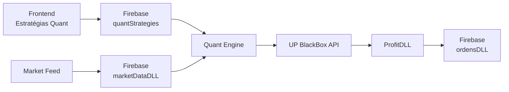

# 📁 Estrutura do Projeto - Quant Engine

```
services/quant/
│
├── 🚀 EXECUTÁVEIS PRINCIPAIS
│   ├── quant_engine.py          # Motor principal das estratégias quant
│   ├── start_quant_engine.bat   # Script para iniciar o engine (Windows)
│   └── install.bat              # Instalador automático
│
├── 🧪 TESTES E VALIDAÇÃO
│   ├── test_strategy.py         # Teste da estratégia com dados simulados
│   ├── test_results.json        # Resultados do último teste (gerado)
│   └── voltaamedia_bollinger_backtest.png  # Gráfico do backtest (gerado)
│
├── ⚙️ CONFIGURAÇÃO
│   ├── config.json              # Configurações do sistema e estratégias
│   ├── requirements.txt         # Dependências Python
│   └── venv/                    # Ambiente virtual (criado após install.bat)
│
├── 📖 DOCUMENTAÇÃO
│   ├── README.md                # Documentação completa
│   ├── QUICK_START.md           # Guia rápido de início
│   └── project_structure.md     # Este arquivo
│
└── 📊 LOGS E DADOS (gerados)
    ├── quant_engine.log         # Logs de execução
    └── position_data.json       # Dados de posições (se habilitado)
```

## 🔗 Integração com o Sistema Principal

```
Site-UP/
│
├── src/app/dashboard/market-data/
│   ├── teste-1/                 # ✅ Acomp. Ativos (dados em tempo real)
│   ├── teste-2/                 # ✅ Estratégias Quant (CRUD)
│   └── teste-3/                 # ✅ Monitor de Sinais (visualização)
│
├── services/
│   ├── profit/                  # 📡 Market Data Feed (porta 8001)
│   └── quant/                   # 🧠 Quant Engine (este projeto)
│
├── UP BlackBox 4.0/
│   ├── main.py                  # 🔌 API Principal (porta 8000)
│   └── secrets/                 # 🔐 Credenciais Firebase
│
└── firestore.rules              # 🛡️ Regras de segurança Firebase
```

## 🔄 Fluxo de Dados



## 📊 Estrutura de Dados Firebase

### Coleção: `quantStrategies`
```json
{
  "id": "estrategia123",
          "nome": "Voltaamedia_Bollinger_1min_WINQ25",
  "status": true,
  "carteiraBlackBox": "estrategia_bb4_id",
  "tamanhoPosition": 10.0,
  "createdAt": "timestamp",
  "updatedAt": "timestamp"
}
```

### Coleção: `marketDataDLL/{ticker}/candles_1m`
```json
{
  "t": 1704110400000,
  "o": 118000,
  "h": 118200,
  "l": 117800,
  "c": 118100,
  "v": 1500,
  "vf": 177150000
}
```

## 🎯 Arquivos por Funcionalidade

### 🚀 Execução Principal
- **`quant_engine.py`**: Lógica principal, monitoramento, execução de estratégias
- **`start_quant_engine.bat`**: Wrapper para execução no Windows

### 🧪 Testes e Validação
- **`test_strategy.py`**: Simulação completa com dados fictícios
- **`install.bat`**: Setup automático + teste inicial

### ⚙️ Configuração
- **`config.json`**: Parâmetros da estratégia, URLs, limites de segurança
- **`requirements.txt`**: Dependências Python versionadas

### 📖 Documentação
- **`README.md`**: Manual completo com exemplos
- **`QUICK_START.md`**: Guia de 5 minutos para começar
- **`project_structure.md`**: Visão geral da arquitetura

## 🔧 Como Adicionar Nova Estratégia

### 1. Backend (quant_engine.py)
```python
async def minha_nova_estrategia_handler(self, strategy: QuantStrategy):
    # Sua lógica aqui
    pass

# Registrar no __init__:
self.strategy_handlers = {
            "Voltaamedia_Bollinger_1min_WINQ25": self.voltaamedia_bollinger_handler,
    "MinhaNova_Estrategia": self.minha_nova_estrategia_handler,  # ✅ Adicionar
}
```

### 2. Configuração (config.json)
```json
"strategies": {
  "MinhaNova_Estrategia": {
    "enabled": true,
    "ticker": "PETR4",
    "exchange": "B",
    "timeframe": "5m",
    "custom_params": {
      "param1": "valor1"
    }
  }
}
```

### 3. Frontend
- Criar estratégia com nome **exato**: "MinhaNova_Estrategia"
- Selecionar carteira BlackBox de destino
- Ativar status

## 🔍 Monitoramento e Debug

### Logs Importantes
```bash
# Tempo real
tail -f quant_engine.log

# Filtrar por estratégia
grep "Voltaamedia" quant_engine.log

# Filtrar erros
grep "ERROR" quant_engine.log
```

### Interfaces Web
- **Estratégias**: `localhost:3000/dashboard/market-data/teste-2`
- **Monitor**: `localhost:3000/dashboard/market-data/teste-3`
- **Ordens**: `localhost:3000/dashboard/up-blackbox4/ordens`

## ⚡ Performance e Recursos

| Componente | CPU | RAM | Disk |
|------------|-----|-----|------|
| Quant Engine | ~5% | ~50MB | ~10MB/dia logs |
| Market Feed | ~10% | ~100MB | ~50MB/dia dados |
| UP BlackBox API | ~15% | ~200MB | ~100MB/dia |

## 🛡️ Segurança e Backup

### Arquivos Críticos
- ✅ `config.json` - Backup diário
- ✅ `quant_engine.log` - Rotação automática
- ✅ Firebase rules - Versionamento Git

### Modos de Segurança
- 🟢 **Paper Trading**: Tudo simulado
- 🟡 **Limited Live**: Posições pequenas
- 🔴 **Full Live**: Produção completa

---

**💡 Dica**: Sempre comece com `paper_trading_mode: true` e monitore por alguns dias antes de ativar trading real! 